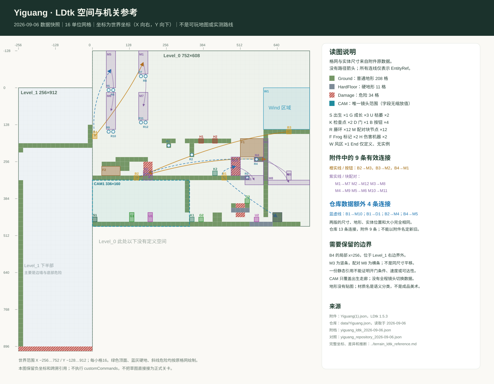

# LDtk 关卡附件与上游空间参考

记录日期：2026-09-06。范围是保存来源、解析空间与机关引用、比较版本并提出局部流程候选。本轮没有修改玩法实现、正式场景或既有设计文档，没有新增可玩场景。附件中的 customCommands 等内容只按数据保存，未执行。

## 1. 来源与可复核副本

| 来源 | 归档文件 | 核查结果 |
|---|---|---|
| 用户附件 Yiguang(1).json | [附件原数据](reference_levels/yiguang_ldtk_2026-09-06.json) | 按原始文件逐字节复制；LDtk 1.5.3 |
| 仓库 data/Yiguang.json | [仓库数据快照](reference_levels/yiguang_repository_2026-09-06.json) | 与附件同项目 IID；空间完全一致，按钮引用更完整，见第3节 |
| Git 同步留下的 upstream_level_01.tscn | [上游场景文本快照](reference_levels/upstream_level_01_bb9c9f9.tscn.txt) | 与提交 bb9c9f9402157c74e883077938a854e32a36b236 的 scenes/levels/level_01.tscn 文本完全一致；使用 .tscn.txt 避免成为可玩场景 |
| 数据空间图 | [静态 SVG](reference_levels/yiguang_ldtk_space_2026-09-06.svg) | 按真实格网、矩形和引用绘制；蓝虚线仅表示仓库多出的四条引用，不是路线 |

附件原路径为 C:/Users/Administrator/Documents/xwechat_files/wxid_tfy1u9u2pvt322_d63d/temp/RWTemp/2026-09/d9a153247ee1e577cdd1ffefaa7c0ff4/Yiguang(1).json。上游暂存路径为 build/upstream-sync-2026-09-06/upstream_level_01.tscn。

上游来源提交：bb9c9f9402157c74e883077938a854e32a36b236，提交时间 2026-09-06T04:16:39+08:00，标题“Merge pull request #9 from coicy/feat/coicy”。读取时仓库 HEAD 为该提交。data/Yiguang.json 最近一次提交为 1a4277f8094f9fb2bad8b7fe1008c87c98f00087，时间 2026-09-06T00:41:56+08:00，标题“feat: add button-operated door, exit completion, and HUD”。提交记录说明仓库来源，不能由此推断附件何时制作。

## 2. 真实空间结构

世界布局为 Free，16 单位网格，只有 Ground IntGrid 与 Entities 两层，无外部关卡、无实际贴图瓦片。所有图层偏移为0。两版均有43个实体实例、253个非空地形格。

| 空间 | 世界左上角 | 尺寸 / 格数 | 地形格 | 实体 |
|---|---|---|---|---|
| Level_0 | (0,-128) | 752×608 / 47×38 | Ground 151、Damage 18、HardFloor 11 | 42 |
| Level_1 | (-256,0) | 256×912 / 16×57 | Ground 57、Damage 16 | 1，按钮 B4 |

两个空间在 X=0 处相邻，世界包围范围为 X=-256…752、Y=-128…912。Level_1 的下半部主要为空间、左墙和底部危险，不是已经设计完整的第二段探索路线。

### Level_0：下层教学与上层折返结构

以下坐标均为 Level_0 局部坐标；世界 Y=局部 Y-128。

- 下层主面在 y592。出生 S1=(0,576)，第一组成长 G1=(128,560) 与枯萎 U1=(192,560) 位于左侧安全走廊；x320 的竖隔墙从 y448 延伸到 y560，下方留下32高通道。K1=(336,576) 与下一成长 G2=(368,576) 在隔墙另一侧。**设计推断**：这里通过“先成长、再缩小穿洞、穿洞后恢复”讲解形态，并在穿越后设检查点；静态数据不证明实际玩家已走通。
- y432 有从 x0 到 x512 的长隔层，接32宽 HardFloor；更高处有 y368、y384 和 y304 的平台。两个检查点分别在下层 (336,576) 与中层 (416,416)，具备分层推进的结构。
- 左上在 x48、x160 排列两列 MoveableCube 配对节点，配有8个成对藤环；中右另有4个环。右上 W1=(592,128)、160×144，底缘靠近 y272 平台与 B3=(672,272)。**设计推断**：藤环、移动结构与风区可能组成上行和折返路线，数据没有风力、移动速度、能力要求或环连接范围，不能把该推断写成已成立的通路。
- 右下有 HardFloor、Damage、成长 G3、枯萎 U2 和门 D1=(624,560)。Frog 两个矩形标记与 DamageMachine 两个标记没有战斗参数，不能直接对应三种普通敌人或精英。

### Level_1：跨房控制点与大落差边界

该房局部 y192 有一条256宽平台；最底部 y896 为整排危险。唯一按钮 B4 的局部坐标是 (256,160)，已位于宽度256的右边界之外，其世界坐标 (0,160) 落在 Level_0 范围内。导入器若按房间边界裁掉实体，会丢失这条控制链。这里应保留数据现状并明确标注，不能擅自把按钮移动一格后声称忠实还原。

### 镜头数据

唯一 Camera 实例 CAM1 的局部矩形是 (0,448,336,160)，对应世界 (0,320,336,160)，恰好框住出生、第一组成长/枯萎资源和低洞入口。336:160 与1344:640同为2.1:1，说明画幅比例相符；Camera 实体没有缩放、跟随、切换字段，两个关卡的 Camera Tile 字段均为 null。不能把矩形直接解释为 zoom=4 或完整相机逻辑。

## 3. 附件与仓库数据：空间同版，连接不同

逐字段比较结果：项目 IID、版本号、两个空间尺寸和世界位置、全部格网、43个实体的标识/位置/尺寸以及6条块配对引用完全相同。只有4条按钮目标引用在仓库中存在、附件中缺失；realEditorValues 中另有4处对应的编辑器存储差异。没有其他 JSON 值差异。

| 按钮 | 附件目标 | 仓库目标 | 差异含义 |
|---|---|---|---|
| B1：Level_0 (448,432) | 空数组 | M10=(480,368)、D1=(624,560) | 仓库把此处接到可变结构和门；附件未接线 |
| B2：Level_0 (144,432) | M3=(592,304) | M3 与 M4=(560,368) | 仓库让左侧按钮同时控制右侧两项结构 |
| B3：Level_0 (672,272) | M2=(176,416) | M2 | 相同，右侧按钮控制左侧结构 |
| B4：Level_1 (256,160) | M1=(160,0) | M1 与 M5=(48,0) | 仓库让跨房按钮同时控制两列上方结构 |

附件含9条非空 EntityRef，仓库含13条；全部目标 IID 都能在数据中找到。仓库版本在按钮接线上更完整，但这不证明运行时门一定可开启，也不能凭文件名认定附件更新。

### 完整有效引用表

编号与空间图一致。表中的“配对”只表示 MoveableCube.Entity_ref，不能把两个节点误算成已经会同时移动的两块平台。

| 源 | 目标 | 引用类别 | 版本 |
|---|---|---|---|
| B2 | M3 | 按钮引用 | 两版一致 |
| M1 | M7 | MoveableCube 配对引用 | 两版一致 |
| M2 | M12 | MoveableCube 配对引用 | 两版一致 |
| M3 | M8 | MoveableCube 配对引用 | 两版一致 |
| M4 | M9 | MoveableCube 配对引用 | 两版一致 |
| B3 | M2 | 按钮引用 | 两版一致 |
| M5 | M6 | MoveableCube 配对引用 | 两版一致 |
| M10 | M11 | MoveableCube 配对引用 | 两版一致 |
| B4 | M1 | 按钮引用 | 两版一致 |
| B1 | M10 | 按钮引用 | 仅仓库数据 |
| B1 | D1 | 按钮引用 | 仅仓库数据 |
| B2 | M4 | 按钮引用 | 仅仓库数据 |
| B4 | M5 | 按钮引用 | 仅仓库数据 |

M3 的矩形为16×144，M8为144×16；M4为32×16，M9为16×32；M10为32×64，M11为64×32；M1与M7高度也不同。这些配对包含尺寸或方向变化，不能直接用只做平移的 MovingPlatform 一比一代替。其他空的 MoveableCube.Entity_ref 可能是终点标记，但其运行含义仍需由原实现确认。

## 4. 上游 Godot 场景是另一份实际摆放

上游文本快照使用 handbuilt_level.gd 与手工组件，并非两张 LDtk 房间的等坐标实现。可见结构包括：主地板 (-256,469)、1344×40；上层长地板 (-262,-3)、1344×40；中间台面 (-262,210)、420×40；两个带手工轮廓的缩放岩台、旋转枝墙、营养/毒素点、检查点 (329,438)、出生标记 (-229,465)。唯一显式藤环放在 (1626,721)，不能因此认定已连成完整上层路线。

它的 PhantomCamera2D 显式设置 zoom=(3,3)、follow_offset=(0,-80)、阻尼(0.12,0.18)、死区宽0.6/高0.52、横向lookahead_time=0.2；这些是上游场景属性，与 LDtk 的 Camera 矩形应分开记录。没有运行该快照，未验证镜头边界或路线可玩性。

值得保留的是分层空间、植物承托和场景中可编辑的实体轮廓。不能用上游坐标替换已按玩家跳跃、敌人身高和战斗视野推导的七区尺寸。

## 5. 适合七区关卡的局部候选

本节是设计分析，尚未实现或验收；不覆盖现有七区布局与战斗规则。优先吸收“短范围内看见结果的机关”“能力路线后的捷径”和“完成高差后才进入战斗”，保留战斗主面、敌人数量、出口与重试所有权。

### 候选A：树冠下层压力台 → 维修升降捷径

**意图**：在树冠下层完成可步行的恢复流程后，玩家站上压力台，触发同屏维修升降台，从接住层555升到右侧落地根台350。借鉴附件的按钮→移动结构引用，使用现有 MovingPlatform；固定回程 x5840/5940/6040、台面510/465/420继续保留，右主地基仍从x6140开始。

建议流程：落到下层 → 按需要枯萎/探索 → 步行至营养点恢复 → 走上带压力面的维修台 → 看到支架/灯或杆件动作 → 随台上升 → 跨到右根台 → 沿安全主面进入庭院。错过升降或提前离台时仍可用固定梯返回。升降不控制营养点、战斗门或必需出口，不以移走固定梯制造使用要求。

已有代码只读核对结果：TriggerButton 对 player 的 body_entered 单次触发并调用目标 activate()；MovingPlatform 按 destination_offset 单次平滑移动，结束后停在终点，没有自动往返。因而优先把压力面随台放在 Body/Attachments 内，让玩家先登台再触发；远处地面按钮会有“台先开走、玩家未上台”的问题。若压力面仍放地面，必须另有明确候车/登台逻辑，不能假定现组件自带延迟。

几何候选可从营养点右侧约x5720附近斜升到右根台左缘；例如宽112、厚8，起始左上(5720,555)，目标(5994,350)，offset=(274,-205)，右缘到6106，与6090开始的右根台有16重叠。这只是待验证的泊位草案，不是已批准坐标：

- 不能简单把竖直升降井放在x5840–6140，因为会穿过已有三段回程梯。上述斜升方案同样经过单向台下方，必须测真实载人运动、向上穿越和头部净空，不能仅凭平台本体不碰撞地形判定安全。
- 起始555与现有接住地面同面，必须明确玩家实际站在移动体上；不能依靠共面碰撞偶然选择支撑。泊位调整也不能在离站后留下困住幼芽的坑。
- 起始至终点相差205，按1344×640、缩放2.5计算可见高256；加成熟身高46后只余5，尚未包含边距和HUD。要达到“同屏看清全程”，需局部镜头构图或稍拉远，不能只沿用当前跟随镜头。
- 一次升降到顶后再次掉入下层时走固定梯；若未来需要召回，应独立设计，不冒称现 MovingPlatform 已支持。按钮和台的重试状态必须成对恢复或成对保留。

### 候选B：车间清场后短维修台 → 预览树冠入口

可将流程放在车间第二房出口之后的4920–5080安全过渡，避免干扰机兵学习和两敌战斗：玩家离开已清空房间 → 踩可见压力板 → 同屏的维修台下降停靠 → 可选跳上台观察树冠，再落回原有连续主路。主地面y400和战斗门始终保留，按钮不与遭遇完成或精英出口共用状态。

一个可计算的侧台候选是x4944–5056、宽112、厚8，台面从270下降到340，最终台底348，地面400上保留52净高。压力板位于出口后的主路，例如x4928附近；最终台面高差60属于可选挑战，不作为必经台阶。该候选适配现有单目标平移接口，和原数据中的竖条变横条不同。平台侧边必须有明确支撑与可见薄沿；正式坐标需要避开既有装饰/相机提示并做真实跳跃及头顶净空检查。

两项候选都让机关结果在当前活动区可见，保留原数据折返意图，同时避免把B2→M3这种跨448单位的远程控制直接搬到短教学房而让玩家看不到结果。若后续增加跨屏效果，需要显示目标或进行可控镜头提示；静态引用本身不提供这类反馈。

## 6. 数据局限与下一步证据

- End只有定义、没有实例。附件门没有按钮引用；仓库补了门引用，但JSON没有胜利条件或结果流程参数。
- Camera仅一块矩形，两空间Camera字段为空；没有完整镜头转换序列。
- 没有实际贴图瓦片，Ground/HardFloor/Damage是语义分类；不能当成已完成地形美术。
- 没有敌人AI、生命、攻击数据，也没有移动时长、风力、能力限制或重试状态；不能证明10–15分钟体验、战斗公平性或所有路线可达。
- 原空间上部移动结构与大落差需要重算能力容差；七区现有共同跳跃链、幼芽恢复路和战斗净空优先保留。

后续若采用候选A，针对性验收应覆盖幼芽步行恢复、两形态站台触发/载人/离台、与固定梯的扫掠、掉落后再次返回、按钮和升降台的死亡重试、镜头与提示。候选B应验证降台停靠后成熟形态可从下通过、台前不误挡出口、可选跳上后自然落回主路。以上未在本轮执行。

## 附表：图中所有实体坐标

LDtk实体位置按左上角计算，pivot=(0,0)。编号仅用于本次文档与静态图，不改原IID。

| 图中编号 | 空间 / 类型 | 局部左上角 | 世界左上角 | 尺寸 |
|---|---|---|---|---|
| S1 | Level_0 / Start | (0, 576) | (0, 448) | 16×16 |
| CAM1 | Level_0 / Camera | (0, 448) | (0, 320) | 336×160 |
| U1 | Level_0 / UnGrowDrug | (192, 560) | (192, 432) | 16×32 |
| G1 | Level_0 / GrowDrug | (128, 560) | (128, 432) | 16×32 |
| G2 | Level_0 / GrowDrug | (368, 576) | (368, 448) | 16×16 |
| U2 | Level_0 / UnGrowDrug | (560, 576) | (560, 448) | 16×16 |
| F1 | Level_0 / Frog | (512, 304) | (512, 176) | 80×64 |
| D1 | Level_0 / Door | (624, 560) | (624, 432) | 32×32 |
| G3 | Level_0 / GrowDrug | (528, 512) | (528, 384) | 16×16 |
| B1 | Level_0 / Button | (448, 432) | (448, 304) | 16×16 |
| R1 | Level_0 / Ring | (256, 320) | (256, 192) | 16×16 |
| R2 | Level_0 / Ring | (336, 352) | (336, 224) | 16×16 |
| R3 | Level_0 / Ring | (528, 432) | (528, 304) | 16×16 |
| F2 | Level_0 / Frog | (32, 400) | (32, 272) | 64×32 |
| B2 | Level_0 / Button | (144, 432) | (144, 304) | 16×16 |
| R4 | Level_0 / Ring | (560, 368) | (560, 240) | 16×16 |
| M1 | Level_0 / MoveableCube | (160, 0) | (160, -128) | 32×80 |
| H1 | Level_0 / DamageMachine | (368, 304) | (368, 176) | 16×16 |
| H2 | Level_0 / DamageMachine | (416, 304) | (416, 176) | 16×16 |
| M2 | Level_0 / MoveableCube | (176, 416) | (176, 288) | 32×16 |
| R5 | Level_0 / Ring | (48, 128) | (48, 0) | 16×16 |
| R6 | Level_0 / Ring | (64, 128) | (64, 0) | 16×16 |
| R7 | Level_0 / Ring | (160, 80) | (160, -48) | 16×16 |
| R8 | Level_0 / Ring | (176, 80) | (176, -48) | 16×16 |
| W1 | Level_0 / Wind | (592, 128) | (592, 0) | 160×144 |
| M3 | Level_0 / MoveableCube | (592, 304) | (592, 176) | 16×144 |
| M4 | Level_0 / MoveableCube | (560, 368) | (560, 240) | 32×16 |
| B3 | Level_0 / Button | (672, 272) | (672, 144) | 16×16 |
| K1 | Level_0 / Checkpoint | (336, 576) | (336, 448) | 16×16 |
| K2 | Level_0 / Checkpoint | (416, 416) | (416, 288) | 16×16 |
| M5 | Level_0 / MoveableCube | (48, 0) | (48, -128) | 32×128 |
| M6 | Level_0 / MoveableCube | (48, 144) | (48, 16) | 32×128 |
| M7 | Level_0 / MoveableCube | (160, 144) | (160, 16) | 32×96 |
| R9 | Level_0 / Ring | (48, 272) | (48, 144) | 16×16 |
| R10 | Level_0 / Ring | (64, 272) | (64, 144) | 16×16 |
| R11 | Level_0 / Ring | (160, 240) | (160, 112) | 16×16 |
| R12 | Level_0 / Ring | (176, 240) | (176, 112) | 16×16 |
| M8 | Level_0 / MoveableCube | (608, 448) | (608, 320) | 144×16 |
| M9 | Level_0 / MoveableCube | (672, 416) | (672, 288) | 16×32 |
| M10 | Level_0 / MoveableCube | (480, 368) | (480, 240) | 32×64 |
| M11 | Level_0 / MoveableCube | (528, 432) | (528, 304) | 64×32 |
| M12 | Level_0 / MoveableCube | (176, 432) | (176, 304) | 32×16 |
| B4 | Level_1 / Button | (256, 160) | (0, 160) | 16×16 |
