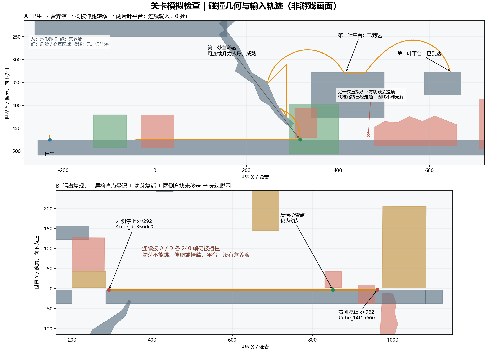

# 关卡模拟游玩检查

2026-09-06。以当前保存的正式组合关卡为准。已按用户要求移除出生区 `LiftCube` 及随附 `LiftButton`；其他地形、方块和 Ring 的位置未因本次检查调整。

**已从出生点连续走到第二片叶平台，0 死亡；发现一个有条件的上层复活软锁和机关接线缺口。原先缺失的通关条件已按最新用户要求设为触碰 `Button_59bb7020`。尚未从出生点走完整个上层，也未完成整关路线验证。**

## 方法与覆盖

- Godot 4.7.2 CLI，60 Hz 物理，`--headless --fixed-fps 60`。键盘与鼠标经 `Input.parse_input_event()` 派发，保留真实玩家控制器、碰撞、资源吸收、危险区和重生逻辑。
- 连续路线从主菜单启动、跳过开场后正常出生，全程未设置玩家坐标、形态或机关状态。
- 上层软锁测试显式设置了两次起始位置，以隔离检查点与死亡恢复行为；此测试不能证明正常路线会以相同机关状态到达这些位置。
- 另做了共享组件的吸收升降阶、扎根伸腿、跳跃滑翔、藤蔓挂接与 E 攀爬输入检查，均通过。这些组件结果不等于整关可通。
- 本轮没有做实际画面、音效、提示可见性和人工操作手感的验收。下图来自运行时碰撞形状和输入轨迹，不是游戏截图。



## 已走通的连续路线

| 步骤 | 运行结果 |
| --- | --- |
| 菜单开始、跳过开场、出生落地 | 正常解除暂停，出生落地约 `(-229,475.49)` |
| 幼芽向右穿过原升降方块位置与树枝下方 | 到达第二处营养液约 `(317.67,475.43)`，0 死亡 |
| 按 E 吸收 | 正常长成人形；松 E 再按也可成长为成熟体 |
| 人形向左跳上低处树枝 | 落在约 `(286.73,423.90)`，可以扎根 |
| 扎根向上伸腿，再拔根向左落下 | 伸腿到 `(286.73,311.90)`；落到中段树枝约 `(247.85,350.72)` |
| 转向右跳 | 落在第一片叶平台约 `(416.94,327.43)` |
| 向右跳到下一平台 | 落在第二片叶平台约 `(646.61,326.68)`，整段仍为 0 死亡 |

复现计划：`build/qa/playthrough/second_leaf_plan.json`。逐帧记录：`build/qa/playthrough/second_leaf.json`；日志：`build/qa/playthrough/second_leaf.log`。该计划使用默认入口引用，没有内存替换关卡。

树枝转移需要控制落点和转向时机。直接从第二处营养液向右走，再在叶平台下起跳，会撞到平台底面并随后碰刺；已找到上述合法路线，因此不把这个失败操作判成关卡无解。可以考虑用关卡提示引导玩家利用树枝和伸腿转移。

## 阻塞点与流程缺口

### 1. 上层检查点的幼芽复活软锁：有条件，已物理复现

前提：上层检查点已登记，`Cube_de356dc0` 与 `Cube_14f1b660` 仍在当前初始位置。

测试先把成熟角色放到上层检查点，让实际碰撞登记检查点；再显式放入左侧毒雾。随后仅通过物理等待和正常输入，让毒雾自然消耗稳定性，依次枯萎成人形、幼芽，再向左坠落并触发真实死亡。

- 毒雾导致两次自然枯萎，未强制调用形态切换。
- 坠落死亡后回到约 `(851,-23)`，**形态仍为幼芽**。
- 持续按 D 240 帧，停在 `x≈962.02`，碰撞对象为 `Cube_14f1b660`。
- 持续按 A 240 帧，停在 `x≈292.02`，碰撞对象为 `Cube_de356dc0`。
- A+空格持续 80 帧仍不能通过；左键与 W 不产生伸腿或藤蔓。
- 两侧之间由完整 Ground14 承托，上层没有营养液，幼芽无法靠正常移动恢复形态或返回下层。右行还会踩到空按钮，但它不会打开右侧方块。

原因：`features/level/handbuilt/handbuilt_level.gd` 的死亡处理恢复位置和速度，保留当前形态与资源状态；该检查点附近的通行条件又要求能够跳跃或使用能力。

建议优先选择一种恢复策略：检查点保存并恢复可通行形态/资源状态，或为该平台补充幼芽可用的退路/营养液。应同时检查机关已移动与未移动两种状态。不能只依赖玩家按 R 重开整局。

复现计划：`build/qa/playthrough/checkpoint_final_plan.json`。逐帧记录：`build/qa/playthrough/checkpoint_final.json`；日志：`build/qa/playthrough/checkpoint_final.log`。最终复测使用当前默认入口，无内存场景替换。

### 2. 一枚 Ring 的显现条件永远不会满足：接线已确认

`Ring_e33e56b0` 被配置为等待 `Cube_dbcf3f60` 到位后才显示。当前方块既没有按钮目标引用，也没有 `activation_event`，因此现有操作链不会启动它，该 Ring 会一直不可用。

需要为这个方块补上设计上应有的触发来源，或取消这枚 Ring 的延迟显示条件。原有 `Ring_e638aaf0` 有 `Button_17ea7d40 → Cube_3c92f320` 触发链，不能把它的初始隐藏算成同一问题。

### 3. 空按钮及未触发机关：功能缺口已确认，具体路线作用待设计确认

`Button_0f859c40` 位于约 `(914,-3)`，目标数组为空，`event_id` 也为空。实际经过时按钮进入按下状态，方块没有随之动作。

当前 `Cube_322a3230`、`Cube_14f1b660` 也没有独立的按钮或事件触发来源。需要根据预期机关顺序补齐连接；不能仅按节点名称或距离猜测接线。右侧方块未打开已参与上面的幼芽软锁复现。

### 4. 通关完成条件：已按用户指定按钮接入

初次检查时组合关卡没有配置正常通关结束流程。2026-09-06 用户先指定 `Button_bbbb4660`，随后将终点改为触碰 `Button_59bb7020`，HUD 常驻显示“爬到最高处即可通关”。旧按钮仅保留原有机关作用。

现由 `Level_main/Level01` 的 `completion_button_path` 指向 `Button_59bb7020`。实际玩家接触后锁存一次性完成状态，保留其原有 `Cube_de356dc0.activate()` 连接，显示用时和重试次数并暂停关卡，发送 `level_completed(&"level_main")`。完成后不再计时或处理死亡、检查点、毒雾事件。R 键和“再玩一次”均重载当前入口：F6 重开关卡，F5 返回主菜单和开场流程。

聚焦验证脚本为 `tests/scene/test_main_completion.gd`；它把玩家放在按钮上方后由真实物理接触触发，仅验证终点交互与结算，不代表从出生点走通了整关。

HUD 提示使用独立的 `ObjectiveLabel`，不随能力提示、死亡或检查点消息替换。`test_main_level_hud.gd` 已验证文字常驻、1344×640 与 1000×600 排版及原有 HUD 行为；HUD 单场景和默认入口启动也通过。

验证结果：新终点 `Button_59bb7020` 的 Godot CLI 78 项检查全部通过，覆盖真实接触、其他按钮（含旧终点）/非玩家排除、重复触发、原方块启动、完成后状态冻结、F6 暂停时按 R 重开，以及 F5 重玩返回菜单。日志：`build/qa/playthrough/main-completion-59bb7020-verbose.log`。此前 Level01、Level Main 和默认入口启动检查及既有主菜单测试也通过。

## 入口状态与本次修改

检查初期发现重复场景 UID 导致 Main 加载 `res://scenes/level_01.tscn` 旧副本。工作区在检查期间更新了入口引用；最终默认入口和连续路线实际加载的是 `res://scenes/levels/level_01.tscn`。旧副本问题不再列为当前阻塞。本次没有修改入口 UID，也没有用重存整场景覆盖这些更新。

本次按明确要求修改的内容：

- `scenes/levels/level_01.tscn`：删除 `Geometry/Mechanisms/LiftCube`、其子按钮和未使用的按钮场景引用。
- `tests/scene/test_level_event_bus.gd`：移除对已删除升降机关的固定依赖，保留通用事件分发、隔离、动态节点和正式关卡总线生命周期检查。
- `docs/handbuilt_level_building.md`：同步升降方块移除记录。

上述事件总线测试、正式 Level01 当前场景启动、默认应用入口的输入模拟均正常退出，无脚本异常。上层坠落探测曾触发相机边界约束警告；画面跟随不在本轮验收范围。环境中还存在原有的 Windows 根证书读取提示。

最终接线快照：`build/qa/playthrough_wiring/final_report.json`。所有临时驱动脚本、计划、逐帧数据与日志位于被忽略的 `build/qa` 中，没有新增可玩测试关卡。

可复跑连续路线：

```powershell
& '.\Godot_v4.7.2-stable_win64_console.exe' --headless --fixed-fps 60 --path 'D:\Yiguang-GGJ' --log-file 'D:\Yiguang-GGJ\build\qa\playthrough\second_leaf.log' --script res://build/qa/playthrough/play.gd -- res://build/qa/playthrough/second_leaf_plan.json res://build/qa/playthrough/second_leaf.json
```

本轮结论不包含上层每一段跳跃、全部按钮操作顺序和完整终点路径；上层软锁属于明确前提下的恢复行为复现。
