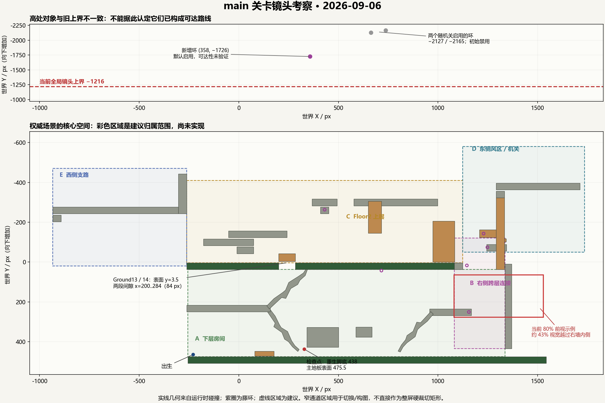

# main 关卡镜头考察

日期：2026-09-06。范围：当前工作区正式主入口及其组合场景。此次为考察与方案修订，没有修改生产场景、镜头脚本、玩家操控或 UID 缓存。

后续状态：用户已授权实施，当前分区版见 [镜头规则与参数](camera_follow_rules.md)。下文保留当时的考察事实，不作为当前缺陷仍存在的断言。

结论：先解决入口加载旧场景的问题，再采用“房间范围 + 跨层连接区 + 受区域约束的前视”。Ground13/14 和 StartFloor 仍是用户指定的主地板，但实体支撑范围不能直接代替镜头区域。

## 1. 当前实际入口与权威场景不一致

两个文件使用同一个场景 UID `uid://c3ecyvogpqagh`：

- `scenes/levels/level_01.tscn`：权威场景，包含 `ForwardCameraFraming`、新 HUD 和主地板标记。
- `scenes/level_01.tscn`：当前未跟踪的旧副本，没有新镜头节点及这些主地板标记。

`Level_main.tscn` 的第 3 行同时引用这个 UID 与权威路径，但本次进程实际得到：

```text
ENTRY cached_uid_path=res://scenes/level_01.tscn
ENTRY loaded_scene=res://scenes/level_01.tscn framing=false
```

同时出现继承场景节点移除/移动的恢复警告。旧副本的上层整条地板叫 `StartFloor2`，组合场景试图覆盖的却是 `Floor2`；因此这是关卡组合身份问题，不只是一个镜头参数没有保存。

旧镜头仍有 `(0,-80)` 偏移、宽 60% / 高 52% 死区、阻尼和速度前视。真实渲染中，站定后角色横向在 **50%**，不是新规则的 20%；启动过渡时还出现脚部位于画面高度 **113.6%** 的样本。该启动样本不是稳定状态，约 3 秒后脚部收敛到 88.0%。

旧副本还带有 CameraBounds 缩放 `(1.16,0.9200003)`。组合场景只覆盖其位置和尺寸，因而旧实例的实际边界并非权威版本的 `[-1024,1792] × [-1216,704]`。

证据：`build/camera-validation/main_camera_audit-actual.log`，以及 [实际入口启动画面](../build/camera-validation/audit-actual-01_spawn.png)。下一次实施应保留用户有意的副本内容，为每个场景分配独立身份并修正正式入口；不能直接删除副本或仅清缓存来掩盖重复 UID。

## 2. 权威场景的新镜头仍存在可复现问题

为了单独考察权威场景，在诊断进程内将上述 UID 映射到 `scenes/levels/level_01.tscn`，未写回缓存或场景。以下数据均来自这一对照版本，不能混称为旧副本的表现。

采样分辨率为 1344×640，zoom=3，整屏可见世界范围为 **448×213.33 px**。

| 问题 | 实测/事实 | 对需求的影响 |
| --- | --- | --- |
| 下层检查点重生没有取得主地板 | 检查点脚底 y=438，StartFloor 表面 y=475.5，相差 37.5，超过 32 px 出生探测距离；重生画面底部为 555.33 | 先显示地板下面，落地后底部变回 475.5，镜头中心累计向上修正 79.83 世界像素，约 239.5 屏幕像素 |
| 同一浮台依赖到达历史 | 固定脚底 `(40,-76.51)`，没有踩地历史时画面底部 40.82；先建立 Ground13 归属后，同位置底部 3.5 | 相同区域产生不同画面，前者露出上层地板下方；差异为 37.32 世界像素，约 112 屏幕像素 |
| 主地板表面被直接当作画面底边 | 真实出生站立脚底为画面高度 99.995% | 角色紧贴底边，地板厚度大部分被裁掉；这符合严格几何底限，但不能证明构图舒适 |
| 右侧前视大量看向墙后 | 脚底 `(1170,160)` 时画面 x=1080.4..1528.4，右墙内侧 x=1336.5 | 约 43% 视宽越过内墙；前视应受房间边界与上行目标约束 |
| 高处对象超出旧上界 | 全局上界 -1216；新增默认启用藤环在 `(358,-1726)`，另两环初始禁用，位于 y=-2127/-2165 | 在这些高度的镜头夹具中角色完全出屏；是否属于可达路线仍待验证，不能直接认定必须把整张地图扩到这里 |

证据图片：[检查点重生首帧](../build/camera-validation/audit-intended-13_checkpoint_first_view.png)、[落地后](../build/camera-validation/audit-intended-14_checkpoint_landed.png)、[右侧连接区](../build/camera-validation/audit-intended-07_right_connection.png)。浮台两图分别为 [无历史](../build/camera-validation/audit-intended-11_low_float_no_history.png) / [有主地板历史](../build/camera-validation/audit-intended-12_low_float_with_history.png)。

检查点使用生产死亡/检查点回调，随后运行真实角色落地；浮台、右侧连接、高处位置使用冻结角色的构图夹具。高处夹具不构成路线可达性证明。这里的像素差是两个取景状态之间的差值，并非逐帧测得的单帧最大跳变量。

## 3. 本关需要的区域限制



图中实线几何来自权威组合场景的运行时碰撞数据，彩色虚线是建议的空间归属，尚未实施。它们不是逐个平台的独立摄像机，也不能全都直接填入 Camera2D 的四边限制。

| 区域 | 场景依据 | 需要的限制 |
| --- | --- | --- |
| A 下层出生/解谜房间 | StartFloor 表面 y=475.5；主体空间 x≈-256..1336.5；上层楼板底面约 y=37 | 按房间确定底限，浮台跳跃保持房间归属；左端和右墙约束横向前视。右墙不是整层最外边界，底部 40.5 px 的可通行缝隙应作为另一连接处理 |
| B 右侧跨层连接 | Floor2 右缘 x=1082、右墙内侧 x=1336.5；藤环 `(1155,251)` / `(1248,-74)` | 垂直移动与目标可见性优先；横向趋近连接区域中心，允许前视比例让步；上下层之间连续切换，不等脚踩 Ground14 才认上层 |
| C Floor2 上层房间 | Ground13 x=-262..200，Ground14 x=284..1082，表面 y=3.5；HardFloor01 同高延续到 x=1124 | Ground13/14 共同定义上层显示底限；Ground10/11/12 等浮台继承此归属。HardFloor01 是相邻实地，不应在 x=1082 立刻丢失上层归属 |
| D 东侧风区/机关 | Ground02 x=1292..1712、表面 y=-396.5；按钮 `(1497,-432)`，桥与风区相邻 | 围绕机关、危险与落点取景；局部左右范围替代全局外框，保留连接所需缓冲。机关运动或等待时不要随微小反向输入大幅左右摆镜 |
| E 西侧支路 | Ground06 x=-934..-304，表面 y=-276.5；右端有独立竖墙 | 独立的横向观察范围；与上层连接处混合，不因处于 Ground13 投影外就丢失所在区域；该浮台不是新增主地板 |
| 真正跨层的开口 | Ground13/14 之间 x=200..284，以及外侧连接通道 | 只在通路实际可通过、角色开始跨层时释放旧底限；立即跟随下落并展示可见落点，进入目标房间后收束，不能等最终着地才切换 |

**窄通道不能直接变成硬镜头矩形。** 右侧连接宽约 254.5，少于视宽 448；Ground12 下方通道高约 46.5，远少于视高 213.33。若硬卡四边，只能剧烈放大或出现相互冲突的限制。应将通道用作归属/过渡触发区，在较大的合法显示范围内选择取景中心；密闭小空间若必须隐藏相邻内容，需要遮挡或局部构图，而不是无限夹紧相机。

图中的房间轮廓是初步候选。实际硬显示范围必须包含完整视口和角色必要空间：例如出生点离左地形端仅 27 px，若左界严格取 -256，玩家会接近屏幕左缘；需要少量场景边缘留白，不能一面要求没有任何空白，一面要求恒定 20% 站位。

Floor2 缺口当前有移动方块。源目标是从 `(200,-43,84,40)` 向下移到 `(200,-3,84,40)`，并非“按下后打开缺口”。镜头不能仅按按钮事件就假定这里可以下落。

## 4. 应保留与修订的规则

1. **80% 是空间允许时的前视目标。** 宽阔横向区域沿用 20%/80% 玩家站位；墙边、转角、竖向连接优先保证可玩区域、角色及交互目标可见。需要写明这些例外，不能继续把全关任意位置 80% 当作验收目标。
2. **主地板的语义是楼层显示约束。** 玩家位于上层区域时，无论经过浮台、藤蔓还是升降进入，都应得到同一套显示底限；碰撞只辅助判断站立及真实离开支撑，不能独自决定房间归属。
3. **下落立即响应，边界负责收束。** 在当前楼层内下降，持续跟随至主地板底限；通过真实跨层连接下落时解除旧楼层限制，同时保持角色在屏幕中。过渡不得提前露出禁止区域，也不得等着地才大幅切镜。
4. **重生按目的地直接确定区域。** 出生点和每个检查点都应在首个可见帧获得房间、底限、方向；不要依赖“32 px 内恰好有地板”。
5. **普通跳跃不要逐帧追随全部上下起伏。** 在区域允许的垂直带内稳定取景；越过上缘或持续上升才向上带镜，下落则保证角色和合法落点可见。伸腿/藤蔓采用同样的区域框架，并包含正在操作的目标。
6. **全局外框只作兜底。** 对可用藤环、平台及其运动终点做范围检查；高处对象若是编辑偏移，应先纠正对象位置；若确认是路线，则增加相应区域。不能只扩大空白世界，也不能让真实角色被错误边界丢在屏幕外。

用户要求的“镜头不能看到主地板下面”仍需严格保留。若将它定义为 `画面底部 ≤ 碰撞地表`，站立时脚底贴边是几何上的必然，不能同时承诺脚下留 10% 空间。若希望展示地板厚度并给脚部留空间，需明确允许“地板实体可见、下层内容不可见”，再采用地板底面作为显示边界或使用实体遮挡。这是显示语义的选择，本次没有擅自放宽。

## 5. 最小实施顺序与验收

先处理场景 UID 身份与正式入口；随后在现有单套 PhantomCameraHost + Framing 中加入区域选择和连接过渡，保持真实 Camera2D 的单一写入者。区域数据放在关卡节点/资源中，可配置归属范围、显示边界、主地板、横向构图模式和邻接区；不需要给每块浮台创建新镜头，也不需要更换插件。

下一轮验收至少应包含：

- 默认入口和 Level_main F6 都加载 `scenes/levels/level_01.tscn`；无重复 UID/节点恢复警告，Framing 确实存在。
- 初始出生、下层 `(329,438)` 和上层检查点逐一重生；首帧有正确区域，不出现“先露地下、再向上校正”。
- 同一浮台从下层、主地板和相邻浮台分别进入，区域与最终构图一致。
- 下层右墙前往返、右侧藤环上行及原路下落；目标和落点可见，不将大部分视野放在墙后。
- 缺口方块实际运动前后均验证；只在真实可穿越状态下检查穿层，不用传送越过障碍来宣称路线通过。
- 自由下落、普通跳跃、伸腿与藤蔓移动分别采集实际视图矩形、玩家/目标屏幕位置和每帧镜头位移；看连续过程，不只检查最终比例。
- 高处锚点及机关运动终点的可达性和相机范围单独确认；当前未发现正式场景的出口/完成触发，不能宣称已完成从出生到通关的全流程镜头验收。

实际视图以 viewport/camera 的最终结果为准，不能只读 Camera2D 节点位置；Godot 官方也区分节点位置与经过限制/平滑后的屏幕中心。参见 [Camera2D 官方文档](https://docs.godotengine.org/en/latest/classes/class_camera2d.html)。

## 6. 证据与边界

本次使用 game-studio 的玩法观察、画面可读性和截图验证流程，保留仓库的 Godot 技术栈。两项并行只读审查分别负责实际地形/机关关系和镜头实现/验收盲点。

- 运行环境：仓库 Godot 4.7.2、OpenGL 3.3 Compatibility、NVIDIA RTX 4060 Laptop，1344×640 采样。
- 运行时日志与原始碰撞数据：`build/camera-validation/main_camera_audit-actual.log`、`main_camera_audit-intended.log`、`main_camera_edge_audit.log`、`main_camera_audit-intended.json`。
- 诊断脚本：同目录 `main_camera_audit.gd`、`main_camera_edge_audit.gd`，只实例化正式关卡，不创建可玩的测试关卡。
- 示意图：`docs/main_camera_regions.png`，由运行时碰撞数据生成；诊断重绘脚本为 `build/camera-validation/plot_camera_regions.py`。
- 原镜头实现说明 `docs/camera_follow_rules.md` 记录的是上一轮方案与当时验证，不能作为本次用户反馈已解决的证据。

上述脚本、日志和截图位于被忽略的 build 目录，只供本地审查。未做新的完整人工通关，也未改动用户当前编辑的关卡内容。
